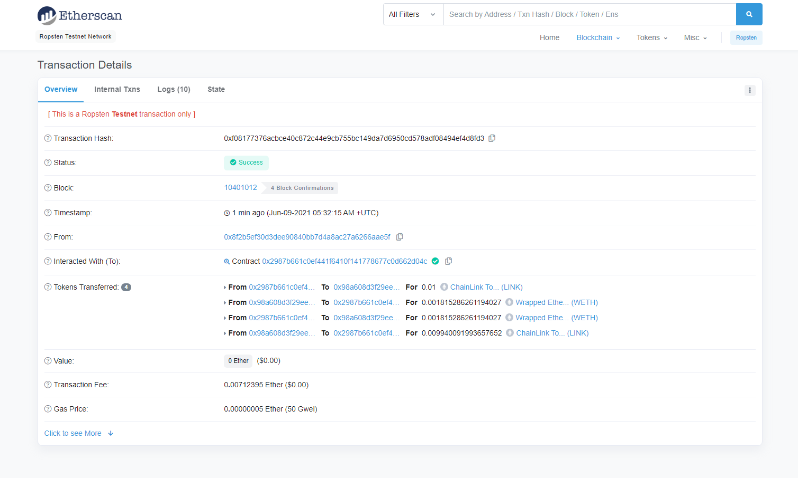

# defi_challenge
1. clone repository to local folder on computer
2. in the project folder run the following to install packages 
```
npm install
```
3. run the following command to migrate smart contract to ropsten
```
truffle migrate --network ropsten --reset
```
4. Manually transfer link token to the smart contract and eth to the smart contract (via metamask on the ropsten network)
5. Run the following code in your terminal within the project directory:
```
node index.js
```

## Thoughts
The most difficult part with the challenge was trying to find a pair that was traded on both uniswap and sushiswap on a testnet while also being able to source funds from a faucet for the token that would be needed to do the swap. This was not possible on the Ropsten network.  The alternative method of doing this would be to fork the mainnet into ganache and run the tests in that manner, using the pools that are available on mainnet (which is the more realistic way of doing this). 

Since Uniswap & Sushiswap are identical  (only the router contract is changed for each protocol while the Interface is the same), I elected to proceed with using uniswap to do both swaps.  The code is complete in the sense that the only change that would be needed would be to point to second swap to the sushiswap router address (where as I have it pointed back to uniswap).  

While this is not technically correct in what was asked, I have tried to make the code as complete as possible while working with the limitations of the testnet

The code currently takes link token and sells it on uniswap for weth.  It will then take the weth back to uniswap and get link again.  Below is a screen shot of the smart contract doing this:

